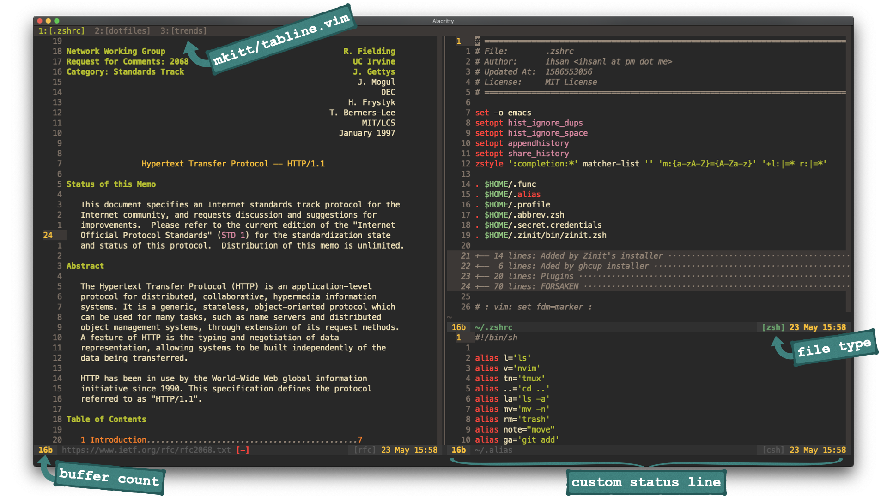

<h3 align=center>ihsan's dotfiles</h3>

<table>
<tr><td>OS</td>
<td><a href="https://www.apple.com/macos/catalina/">macOS Catalina</a></td>
</tr>

<tr><td>WM</td>
<td><a
href=https://en.wikipedia.org/wiki/Quartz_(graphics_layer)>quartz</a> (default)
</td>
</tr>

<tr><td>Shell</td>
<td><a href="https://zsh.org/">zsh</a> with <a
href="https://github.com/zdharma/zinit">zinit</a> plugin manager</td>
</tr>

<tr><td>Terminal</td>
<td><a href="https://github.com/alacritty/alacritty">alacritty</a>
</td>
</tr>

<tr><td>Editor</td>
<td><a href="https://neovim.io/">nvim</a></td>
</tr>

<tr><td>Vim Plug-in Manager</td>
<td><a href="https://github.com/junegunn/vim-plug">vim-plug</a></td>
</tr>

<tr><td>Colors</td>
<td><a href="https://github.com/morhetz/gruvbox">gruvbox</a></td>
</tr>

<tr><td>Browser</td>
<td> <a href="https://www.apple.com/safari/">safari</a> (default)
</tr>
</table>

<h3>$ make ...</h3>
<ul>
<li>vim</li>
<li>bat</li>
<li>zsh</li>
<li>nvim</li>
<li>tmux</li>
<li>emacs</li>
<li>alacritty</li>
<li>vimplug <small><em>(for nvim)</em></small></li>
<li>shell_helpers <small><em>(aliases, functions, abbreviations...)</em></small></li>
</ul>

### TODO
- [ ] I switched to doom emacs. Add doom custom configuration files to this
repo. (Added @1590236484)
