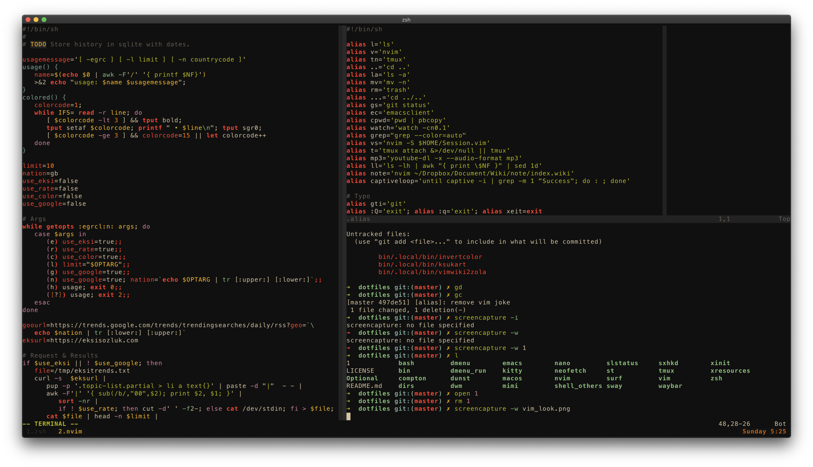

# Dotfiles

## Ready to [stow](https://www.gnu.org/software/stow/)

Install the nvim configuration:

```sh
git clone https://github.com/ihsanturk/dotfiles
cd dotfiles
stow nvim/
```

## Appearance

### neovim @ *2020 Mar 8, 17:35*



## Environment
<table style="margin: auto; width: 50%; display: inline-table;">
<tr><td>OS</td> <td><a href=https://support.apple.com/macos/mojave>macOS
Mojave</a></td> </tr> <tr><td>WM</td> <td> <a
href=https://en.wikipedia.org/wiki/Quartz_(graphics_layer)>quartz</a> (default)
</td></tr> <tr><td>Shell</td> <td> <a href=https://zsh.org/>zsh</a> with <a
href=https://github.com/zdharma/zinit>zinit</a> plugin manager </td></tr>
<tr><td>Terminal</td> <td> <a href=https://sw.kovidgoyal.net/kitty/>kitty<a/>
</td></tr> <tr><td>Editor 1</td> <td> <a href=https://neovim.io/>nvim</a>
</td></tr> <tr><td>Editor 2</td> <td> <a
href=https://www.gnu.org/software/emacs/>emacs</a> for <a
href=https://en.wikipedia.org/wiki/Org-mode>org-mode</a> </td></tr>
<tr><td>Browser</td> <td> <a href=https://www.apple.com/safari/>safari</a>
with <a href=https://github.com/flippidippi/sVim>sVim</a> extension </td></tr>
</table>
