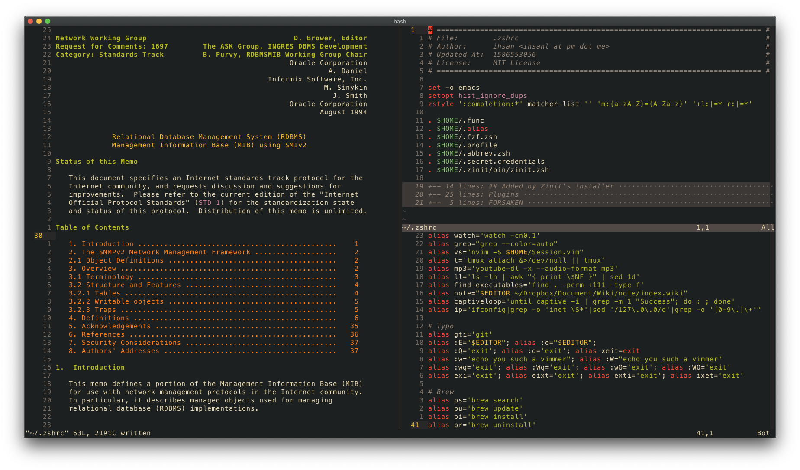

# dotfiles

### neovim @ *2020 Apr 11, 4:20*

<h3 align=left>$ make ...</h3>

<ul align=left>
<li>vim</li>
<li>zsh</li>
<li>nvim</li>
<li>tmux</li>
<li>emacs</li>
<li>alacritty</li>
<li>vimplug <em>for nvim</em></li>
<li>shell_helpers (aliases, functions, abbreviations...)</li>
</ul>

<table align=left style="margin-bottom: 100px; width: 50%;">

<tr>
<td>OS</td>
<td><a href="https://www.apple.com/macos/catalina/">macOS Catalina</a></td>
</tr>

<tr>
<td>WM</td>
<td><a
href=https://en.wikipedia.org/wiki/Quartz_(graphics_layer)>quartz</a> (default)
</td>
</tr>

<tr>
<td>Shell</td>
<td><a href="https://zsh.org/">zsh</a> with <a
href="https://github.com/zdharma/zinit">zinit</a> plugin manager</td>
</tr>

<tr>
<td>Terminal</td>
<td><a href="https://github.com/alacritty/alacritty">alacritty<a/></td>
</tr>

<tr>
<td>Editor</td>
<td><a href="https://neovim.io/">nvim</a></td>
</tr>

<tr>
<td>Browser</td>
<td> <a href="https://www.apple.com/safari/">safari</a>
with <a href="https://github.com/flippidippi/sVim">sVim</a> extension</td>
</tr>

</table>
